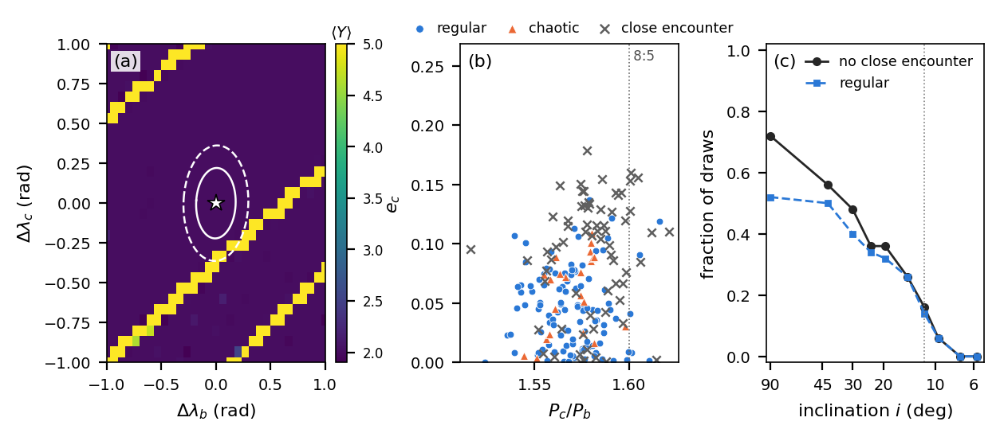

# HD 127195 stability

N-body stability analysis of the two giant planets orbiting the red giant HD 127195, discovered by
[Figueira et al. (2026)](https://doi.org/10.1051/0004-6361/202659966). This repository holds the code and data for the
Research Note *N-body Stability Constraints on the Two Giant Planets of the Red Giant HD 127195*, prepared for
Research Notes of the AAS.

## Results in brief

- A refit of the public radial velocities reproduces the published solution (every median within 0.3σ) and gives the
  mean longitudes the published table omits: λ_b = 4.31 ± 0.12 and λ_c = 1.02 ± 0.15 rad.
- The published solution is regular (MEGNO ⟨Y⟩ = 2.00) and survives 10⁸ orbits of planet b (146 Myr).
- Of 200 draws from the posterior, which pass the angular momentum deficit (AMD) test used in the discovery fit, 110
  are regular; 68 have close encounters within 146 Myr. All 47 draws with both eccentricities below 0.05 survive,
  against 26% of those with an eccentricity of 0.10 or more.
- If both masses scale as 1/sin i, fewer than half of the draws avoid close encounters for i ≤ 30°, and the published
  solution becomes unstable at i ≈ 12°.



*(a) MEGNO for the published solution with its mean longitudes shifted, with the 1σ and 2σ regions of the RV refit;
(b) the Monte Carlo draws by outcome; (c) the fraction of draws that stay regular or free of close encounters as a
function of inclination.*

## Contents

| Path | Description |
|---|---|
| `rv_fit.py` | Refit of the radial velocities with the model, priors and AMD test of the discovery paper |
| `paper_analysis.py` | Reproduces every number and Figure 1 of the Research Note |
| `interaction_check.py` | Size of the planet–planet interaction signal in the radial velocities |
| `data/` | CORALIE radial velocities of HD 127195 from CDS (J/A+A/712/A143) |
| `notebooks/01_jupiter_saturn_validation.ipynb` | Energy conservation and MEGNO tests on the Sun–Jupiter–Saturn system |
| `notebooks/02_gladman_hill_stability.ipynb` | Reproduction of the Gladman (1993) two-planet Hill stability limit |
| `notebooks/03_hd127195_first_tests.ipynb` | Target selection from the NASA Exoplanet Archive and first stability tests of HD 127195 |
| `results/` | Output of the run used in the paper: `results.json`, `rv_posterior.npz` and Figure 1 |
| `requirements.txt` | Python dependencies |

## Reproducing the paper

Python 3.10 or newer:

```bash
python -m venv .venv
source .venv/bin/activate
pip install -r requirements.txt
python rv_fit.py data                 # a few minutes; writes rv_posterior.npz
python paper_analysis.py              # one to a few hours; uses all but one CPU core
python interaction_check.py           # under a minute
```

`paper_analysis.py` prints every number quoted in the paper, labelled [N1] to [N20], and writes Figure 1
(`hd127195_stability.pdf`) and `results.json`, which holds every Monte Carlo draw and its outcome. Each finished
simulation is saved as it completes, so an interrupted run resumes when started again. `WORKERS=4` sets the number of
processes, `--quick` runs a short test of the pipeline, and `--figure` redraws Figure 1 from `results.json`.
Chaotic integrations are sensitive to floating-point rounding, so counts can differ by a draw or two between machines.

## Method

- Radial velocities: two Keplerian orbits, a linear trend, and an offset and a jitter for each CORALIE setup, with
  the priors of the discovery paper, sampled with emcee. As in the discovery fit, configurations that fail the AMD
  test of the kima code (orbit crossing, Laskar & Petit 2017; resonance overlap, Petit et al. 2017) are rejected.
- Integrator: REBOUND 5.2.0 with WHFast and a time step of P_b/30; spot checks with P_b/60, P_b/100 and IAS15.
- Chaos indicator: MEGNO ⟨Y⟩ over 2 × 10⁴ orbits of planet b; ⟨Y⟩ < 2.2 counts as regular.
- Close encounter: the planets approach within the smaller Hill radius, or one is ejected beyond 100 a_c.
- Long runs: every run without an early encounter continues for 10⁷ orbits (14.6 Myr); the published solution and
  the chaotic draws at the minimum masses continue for 10⁸ orbits (146 Myr).
- Inclination: both masses scaled by 1/sin i, for 50 draws at each of ten inclinations.

## Data sources

- Figueira, P., et al. 2026, A&A, 712, A143: published solution (Table 2 and text) and the radial velocities in
  `data/` (CDS catalogue J/A+A/712/A143, licence CC BY 4.0)
- Ottoni, G., et al. 2022, A&A, 657, A87: stellar mass and distance
- NASA Exoplanet Archive, Planetary Systems and Planetary Systems Composite tables (notebook 03)

## License

MIT; see `LICENSE`. The radial velocities in `data/` are from CDS under CC BY 4.0.
